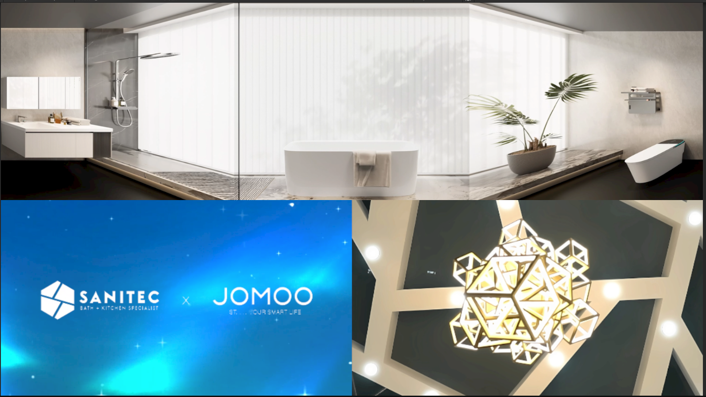

# LED Changeable Content

This program is designed for LED installations equipped with radar for interaction.  
The displayed content can be changed using an Android tablet running [Remote LED Changeable Content](https://github.com/cmmalana/Remote-LED-Changeable-Content).

### Screenshot

### Video Demo
[Watch on Facebook](https://www.facebook.com/share/v/1CoeLnPijQ/)

## Features
- Fetches the video index sent by the Android tablet running [Remote LED Changeable Content](https://github.com/cmmalana/Remote-LED-Changeable-Content).
- Includes interactive water effects triggered by steps and touches on the floor and walls.
- Supports multiple LED Changeable Content displays controlled simultaneously by a single Android tablet.
- No manual IP configuration required — communication uses broadcast.

## Prerequisites
1. Ensure that the Android tablet and the computer running this program are on the same network.  
   - If using radar for touch interaction, ensure all radars and devices are connected to the same network.  
   - If using radar(s) that requires changing the computer’s IP address, configure the Android tablet to match (e.g., all devices should be in `192.168.10.X`).  
2. Use LAN/Ethernet for optimal performance and stability.

## Setup
1. Connect all devices to the same network.  
   - If using static IPs, ensure all devices follow the same IP configuration (e.g., `192.168.10.X`).  
2. Start the Fotomoko app on the Android tablet.  
3. Launch **LED Changeable Content** on the computer.  
4. Test functionality from the Android tablet to confirm everything is working.
